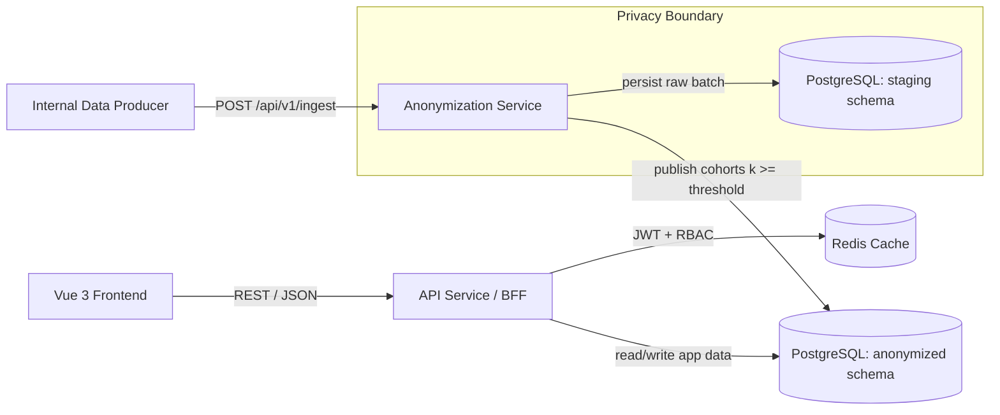
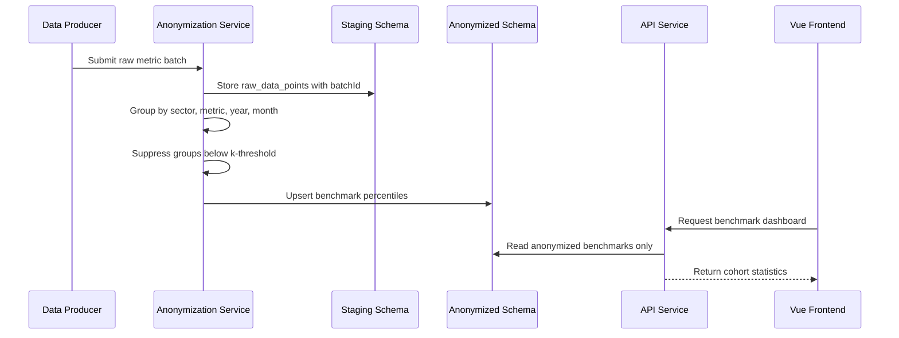
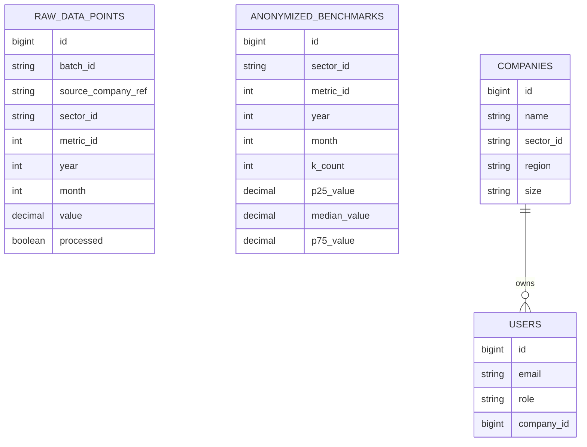

# K-Anonymization BFF Pattern

Privacy-aware financial benchmarking platform built with Spring Boot, Vue, PostgreSQL and Redis. The project demonstrates how to separate raw-data ingestion from product-facing APIs while publishing only cohort-level benchmark statistics.

## Why This Project Exists

Financial benchmarking products need to compare company metrics without exposing individual company performance. This repository models that problem with a two-service backend:

- an internal ingestion and anonymization service that receives raw metric values
- a product API/BFF that serves dashboards, goals and benchmark data to the frontend

The key design constraint is that the user-facing API reads from anonymized tables only. Raw submissions are kept behind a separate service boundary and are transformed into percentile benchmarks only when a cohort reaches the configured minimum group size.

## Portfolio Pitch

**Short version:** A privacy-first benchmarking platform using k-anonymization, Spring Boot microservices, JWT authentication, Redis caching and PostgreSQL schema isolation.

**Interview version:** I built a financial benchmarking system where raw company metrics are ingested through a dedicated anonymization service, grouped by sector, metric and period, and published as P25/median/P75 benchmarks only when the cohort satisfies a minimum k-threshold. The frontend-facing API uses JWT/RBAC, Redis caching and reads exclusively from the anonymized schema, which creates a clear privacy boundary between raw operational data and product analytics.

## System Architecture



## Processing Flow



## Core Capabilities

- Batch ingestion of raw company metric values
- K-threshold suppression for small cohorts
- Percentile calculation for P25, median and P75
- Separate Spring Boot services for ingestion and product-facing API
- PostgreSQL schemas for staging and anonymized data
- Flyway-managed database migrations
- JWT-based stateless authentication
- Role-aware access patterns for admin, analyst and client users
- Redis-backed caching for benchmark and dashboard reads
- Vue 3 dashboard frontend with TypeScript, Pinia and Vue Router
- Docker Compose environment for local development

## Technology Stack

| Area | Stack |
| --- | --- |
| Backend | Java 17, Spring Boot 3.2, Spring MVC, Spring Data JPA |
| Security | Spring Security 6, JWT, BCrypt, role-based authorization |
| Database | PostgreSQL 16, Flyway, schema-level separation |
| Cache | Redis 7, Spring Cache |
| Frontend | Vue 3, TypeScript, Vite, Pinia, Vue Router, Chart.js |
| Runtime | Docker, Docker Compose, Nginx |
| API Docs | Springdoc OpenAPI / Swagger UI |

## Data Model Overview



## Important Technical Decisions

### Separate ingestion from serving

The project uses an ingestion/anonymization service for raw data and a separate API service for dashboard reads. This keeps the product-facing API away from raw submissions and makes the privacy boundary explicit.

### Publish only cohort statistics

Benchmarks are generated per `(sectorId, metricId, year, month)`. Groups smaller than the configured k-threshold are skipped, preventing direct exposure of very small cohorts.

### Cache read-heavy endpoints

Benchmark and dashboard endpoints are natural cache candidates because the data is read frequently and changes only after ingestion events. Redis TTLs keep the implementation simple while leaving room for event-driven invalidation later.

### Use Flyway instead of Hibernate DDL generation

Hibernate validates the schema, while Flyway owns schema evolution. This is closer to a production workflow and makes database changes reviewable.

## Trade-offs

| Decision | Benefit | Trade-off |
| --- | --- | --- |
| Synchronous ingestion | Simple API and easy local demo | Large batches can tie up request threads |
| Schema separation in one Postgres instance | Easy local setup and clear logical boundary | Weaker isolation than separate databases/accounts |
| K-anonymity threshold | Simple privacy control and easy to explain | Does not fully prevent inference attacks |
| Redis TTL caching | Improves dashboard read performance | Can briefly serve stale benchmark data |
| JWT stateless auth | Simple horizontal scaling | Requires token expiry, rotation and revocation strategy |

## Security Notes

This repository uses local-development credentials only. Do not reuse the sample values in a real environment.

Production hardening would include:

- secret management through a cloud secret manager or CI/CD secret store
- separate database users with least-privilege permissions per schema
- authentication and authorization on the ingestion endpoint
- TLS for all service and database communication
- token rotation and refresh-token strategy
- rate limiting and request-size controls
- audit logs for ingestion and benchmark publication
- retention policy for raw staging data

## Privacy Limitations

K-anonymity reduces the risk of exposing individual records, but it is not a complete privacy model by itself. A production-grade analytics product should also consider:

- suppression or generalization of overly specific dimensions
- minimum cohort sizes higher than the demo threshold
- protection against differencing attacks across similar queries
- delayed publication for sensitive cohorts
- query auditing
- l-diversity, t-closeness or differential privacy for stronger guarantees

## Local Development

### Prerequisites

- Java 17+
- Maven 3.9+
- Node.js 20+
- Docker and Docker Compose

### Run the full stack

```bash
docker compose up --build
```

Local services:

| Service | URL |
| --- | --- |
| Frontend | `http://localhost:3000` |
| API Swagger | `http://localhost:8080/swagger-ui.html` |
| Anonymization Swagger | `http://localhost:8081/swagger-ui.html` |

### Run services manually

```bash
docker compose up postgres redis -d
```

```bash
cd anonymization-service
mvn spring-boot:run
```

```bash
cd api-service
mvn spring-boot:run
```

```bash
cd frontend
npm install
npm run dev
```

## Environment Variables

Use `.env.example` as a sanitized starting point for local configuration. Values in that file are placeholders and should be replaced locally.

| Variable | Purpose |
| --- | --- |
| `POSTGRES_USER` | Local PostgreSQL username |
| `POSTGRES_PASSWORD` | Local PostgreSQL password |
| `POSTGRES_DB` | Local PostgreSQL database name |
| `STAGING_DATASOURCE_URL` | JDBC URL for the staging schema |
| `ANONYMIZED_DATASOURCE_URL` | JDBC URL for the anonymized schema |
| `SPRING_DATASOURCE_URL` | JDBC URL used by the API service |
| `JWT_SECRET` | HMAC signing secret for local JWT tokens |
| `JWT_EXPIRATION` | Token lifetime in milliseconds |
| `REDIS_HOST` | Redis hostname |
| `REDIS_PORT` | Redis port |
| `CORS_ALLOWED_ORIGINS` | Allowed frontend origins |

## Demo Authentication

The seed migration creates local demo users for manual testing. These are sample accounts only and should not be used outside local development.

| Role | Email |
| --- | --- |
| Admin | `admin@dataanon.local` |
| Analyst | `analyst@dataanon.local` |
| Client | `client.alpha@dataanon.local` |

## Ingest Sample Data

```bash
curl -X POST http://localhost:8081/api/v1/ingest \
  -H "Content-Type: application/json" \
  -d '{
    "dataPoints": [
      {"sourceCompanyRef":"co-001","sectorId":"MANUFACTURING","metricId":1,"year":2024,"month":1,"value":12.5},
      {"sourceCompanyRef":"co-002","sectorId":"MANUFACTURING","metricId":1,"year":2024,"month":1,"value":14.1},
      {"sourceCompanyRef":"co-003","sectorId":"MANUFACTURING","metricId":1,"year":2024,"month":1,"value":11.8},
      {"sourceCompanyRef":"co-004","sectorId":"MANUFACTURING","metricId":1,"year":2024,"month":1,"value":13.3},
      {"sourceCompanyRef":"co-005","sectorId":"MANUFACTURING","metricId":1,"year":2024,"month":1,"value":15.0}
    ]
  }'
```

## Key API Endpoints

| Method | Endpoint | Purpose |
| --- | --- | --- |
| `POST` | `/api/v1/auth/login` | Authenticate and receive JWT |
| `GET` | `/api/v1/auth/me` | Return current user profile |
| `GET` | `/api/v1/dashboard/overview` | Return dashboard cards and benchmark context |
| `GET` | `/api/v1/benchmarks` | Query anonymized benchmark percentiles |
| `GET` | `/api/v1/metrics` | List active metric definitions |
| `GET` | `/api/v1/companies` | List accessible companies |
| `POST` | `/api/v1/ingest` | Ingest raw metric batch into anonymization service |

## Running Tests

```bash
mvn test
```

```bash
cd frontend
npm install
npm run build
```

Current tests validate application bootstrapping. The highest-value next tests are:

- unit tests for percentile calculation and k-threshold suppression
- repository tests for period filtering and unique constraints
- integration tests for authentication and RBAC
- ingestion tests covering duplicate batches and partial failures
- frontend build and route-guard checks

## Observability

Both backend services expose Spring Actuator health endpoints. For a production version, I would extend this with:

- structured JSON logs with correlation IDs and batch IDs
- metrics for ingestion size, anonymization duration and skipped cohorts
- cache hit/miss metrics
- database pool metrics
- request latency percentiles by endpoint
- alerting for ingestion failures and benchmark publication lag

## Production Evolution Roadmap

1. Add authentication, authorization and rate limiting to the ingestion service.
2. Make ingestion asynchronous with a queue, job status and retry/backoff.
3. Add idempotency keys to prevent duplicate batch processing.
4. Add targeted cache invalidation when benchmarks are updated.
5. Replace demo secrets with secret-manager integration.
6. Split database users and permissions by service/schema.
7. Add Testcontainers integration tests for PostgreSQL and Redis.
8. Add CI checks for backend tests, frontend build and dependency scanning.
9. Add audit logs and data retention policies for staging data.
10. Evaluate stronger privacy controls for inference-resistant analytics.

## What This Project Demonstrates

- Backend architecture with explicit privacy boundaries
- Practical Spring Boot service design
- Database migration discipline with Flyway
- Stateless API authentication
- Cohort-based analytics and aggregation
- Read-model caching strategy
- Trade-off awareness around privacy, performance and operability

## Known Limitations

- Ingestion is synchronous and optimized for demonstration, not high-volume streaming.
- K-anonymity thresholding is a baseline privacy mechanism, not a complete privacy guarantee.
- Cache invalidation is TTL-based rather than event-driven.
- Current automated tests are minimal and should be expanded before production use.
- Local Docker credentials are placeholders for development only.
